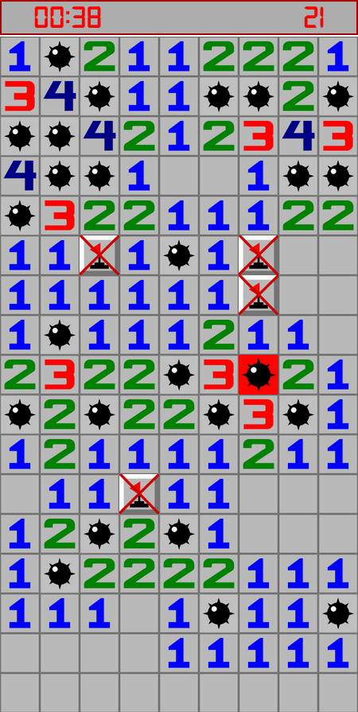

# Minesweeper Game

## Introduction
This is a classic Minesweeper game implemented in JavaScript. Minesweeper is a single-player puzzle game where the objective is to clear a rectangular board containing hidden "mines" or bombs without detonating any of them. The game is played by revealing cells on the board and using numeric hints to deduce the locations of the mines.

## Features
- Dynamic board size: Choose the size of the game board (number of rows and columns).
- Variable mine density: Adjust the number of mines on the board.
- Timer: Track the time taken to complete the game.
- Flags: Mark potential mine locations with flags.
- Win/Loss detection: Detect when the game is won or lost.

## Getting Started
To play the Minesweeper game, simply open the project using live server in vscode. The game interface will be displayed.

## How to Play
1. Click on a cell to reveal its content.
2. If the revealed cell contains a mine, the game ends.
3. If the revealed cell is empty, it will show the number of adjacent mines.
5. Right-click on a cell to place or remove a flag as a marker for potential mine locations.
6. Continue revealing cells and placing flags until all mines are correctly flagged.

## Screenshots

## Technologies Used
- HTML5
- CSS3
- JavaScript

